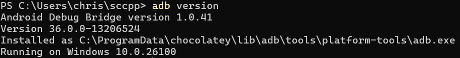

## prereqs

```
gcc -v -E -x c++ -
```
to list directories to include (see c_cpp_properties.json).

Sometimes restarting Visual Studio Code will fix Intellisense.

To build:
`CMake > Delete Cache and Reconfigure > Build`


`Developer Options > enable USB Debugging`
After connecting android device, check connection with `adb devices` and run prog.

- adb forwards e.g. `adb -s "39090DLJH002RY" forward tcp:27183 localabstract:sccpp`
- connects to Sccpp Server (Java) via Socket
- sends handshake; receives back device name
- closes Socket and cleans up adb forward 
